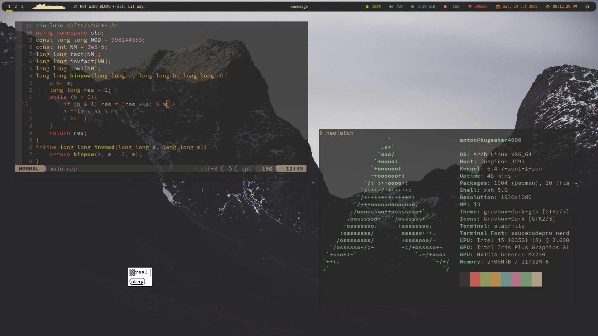

# .files

## general

my dotfiles for my arch linux machine



**DE:** *i3wm*

**Bar:** *polybar*

**Application launcher:** *rofi*

**Terminal emulator:** *alacritty*

**Shell:** *zsh*

**Wallpaper manager:** *nitrogen*

**Editor:** *nvim*

## programs

install all the required programs with the following commands

```
sudo pacman -S python lua i3-wm picom polybar rofi alacritty zsh nvim neofetch nitrogen
```
